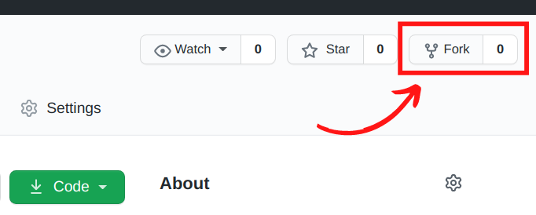
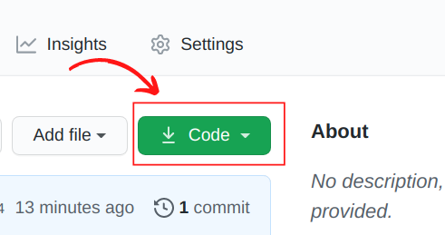
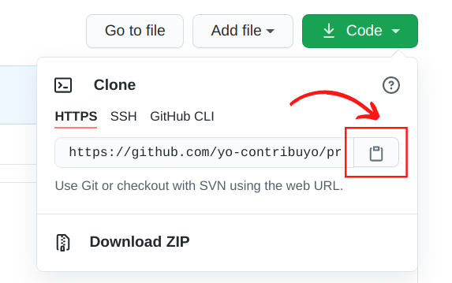
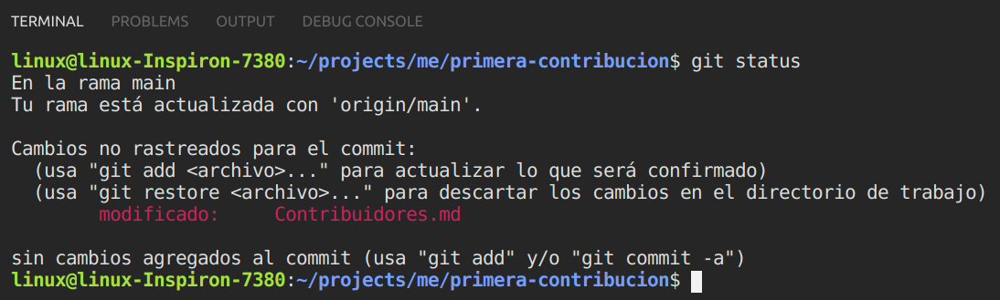
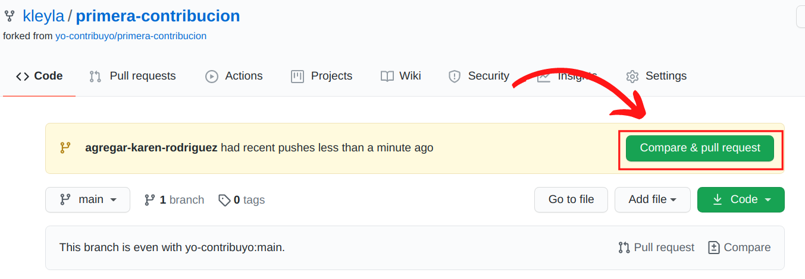
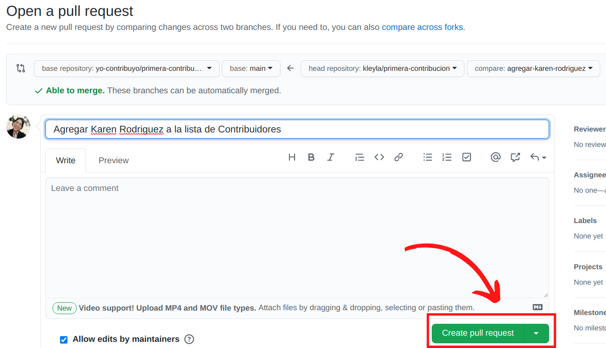
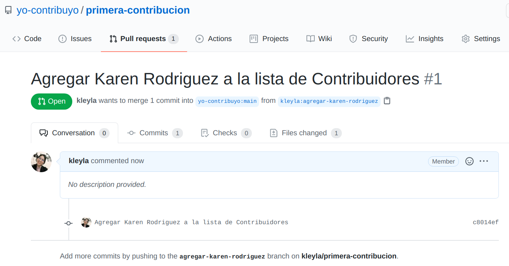

# Primera contribucion

Este proyecto tiene como objetivo simplificar y orientar la forma en que los principiantes realizan su primera contribución. Si desea realizar su primera contribución, siga los pasos a continuación.



## 1. Fork este repositorio

Clic en el botón de "Fork" en la parte superior de esta página. Esto creará una copia de este repositorio en su cuenta.

## 2. Clone el repositorio

Ahora clone el repositorio bifurcado en su computadora. Vaya a su cuenta de GitHub, abra el repositorio que hizo fork, haga clic en el botón de código y luego haga clic en el icono de copiar al portapapeles.





Abra una terminal y ejecute el siguiente comando git:

```
git clone url_que_acaba_de_copiar
```

Por ejemplo:

```
git clone https://github.com/este-es-tu-repositorio/primera-contribucion.git
```

En `este-es-tu-repositorio` debe ir tu usuario de GitHub. Aqui tu estas copiando el contenido del proyecto "Primera contribucion" a tu computadora.

## 3. Crea una rama "branch"

Cambie al directorio del repositorio en su computadora (si aún no está allí):

```
cd primera-contribucion
```

Ahora crea una rama con el comando `git checkout`

```
git checkout -b nombre-de-la-nueva-rama
```

Por ejemplo:

```
git checkout -b agregar-maria-sanchez
```

(El nombre de la rama no necesita tener la palabra `agregar`, pero es razonable incluirlo porque el propósito de esta rama es agregar su nombre a una lista).

## 4. Realice los cambios necesarios y confirme esos cambios

Ahora abra el archivo `Contribuidores.md` en un editor de texto, agregue su nombre. Ahora, guarde el archivo.

Si va al directorio del proyecto y ejecuta el comando `git status`, verá que hay cambios.



Agregue esos cambios a la rama que acaba de crear usando el comando `git add`

```
git add Contribuidores.md
```

Ahora confirme esos cambios usando el comando `git commit`

```
git commit -m "Agregar <tu-nombre> a la lista de Contribuidores"

```

Remplaza <tu-nombre> por tu monbre.

## 5. Pushea los cambios a GitHub

Pushea tus cambios usnado el comando `git push`

```
git push origin <agregar-el-nombre-de-tu-rama>
```

Remplaza <agregar-el-nombre-de-tu-rama> por el nombre de la rama que creaste hace un momento.

## 6. Envíe sus cambios para su revisión

Si va a su repositorio en GitHub, verá un botón Compare & pull request. Haga clic en ese botón.



Ahora envíe la solicitud de pull request.


Como ves ahora tus cambios estan en el proyecto principal, esperando a se fusionados en la rama principal.



Pronto fusionaremos todos sus cambios en la rama principal de este proyecto. Recibirá un correo electrónico de notificación una vez que se hayan combinado los cambios.
